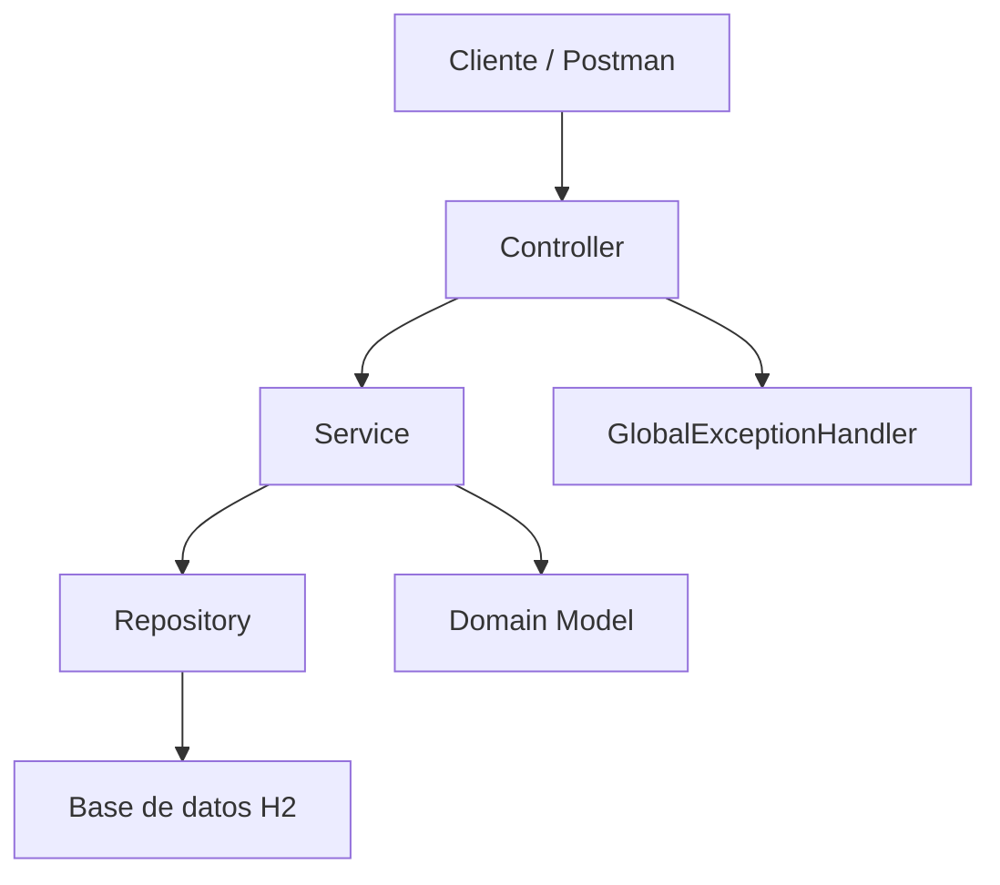

# Taller Post-Contenido 1 - Unidad 7
## API REST de Gestion de Tareas con Arquitectura en Capas

Este proyecto corresponde al taller de la **Unidad 7: Patrones Arquitectonicos I** del curso **Patrones de Diseno de Software**.

La aplicacion implementa una **API REST** desarrollada con **Spring Boot**, aplicando una **arquitectura en capas estricta**, separando claramente las responsabilidades entre presentacion, aplicacion, dominio e infraestructura.

## Objetivo

Implementar un sistema de gestion de tareas que permita:

- listar tareas
- buscar una tarea por ID
- crear tareas
- cambiar el estado de una tarea
- eliminar tareas

Todo esto respetando una arquitectura en capas sin dependencias cruzadas.

## Tecnologias utilizadas

- Java 17
- Spring Boot 3.x
- Spring Web
- Spring Data JPA
- Spring Validation
- H2 Database
- Maven
- Postman

## Estructura del proyecto

```text
com.example.tareas
├── controller
│   ├── GlobalExceptionHandler.java
│   └── TareaController.java
├── service
│   └── TareaService.java
├── domain
│   ├── TareaNotFoundException.java
│   └── model
│       ├── EstadoTarea.java
│       └── Tarea.java
├── repository
│   └── TareaRepository.java
└── TareasApplication.java
```

## Arquitectura en capas

### 1. Capa de Presentacion
Ubicada en `controller/`.

Responsabilidades:
- exponer los endpoints REST
- recibir y devolver solicitudes HTTP
- delegar la logica al servicio
- manejar errores HTTP mediante `GlobalExceptionHandler`

### 2. Capa de Aplicacion
Ubicada en `service/`.

Responsabilidades:
- contener la logica del caso de uso
- coordinar el acceso a datos mediante el repositorio
- aplicar reglas como el estado inicial de una tarea

### 3. Capa de Dominio
Ubicada en `domain/` y `domain/model/`.

Responsabilidades:
- definir la entidad `Tarea`
- definir el enum `EstadoTarea`
- declarar excepciones del negocio como `TareaNotFoundException`

### 4. Capa de Infraestructura
Ubicada en `repository/`.

Responsabilidades:
- acceso a base de datos
- persistencia usando `JpaRepository`

## Diagrama de capas



## Modelo de datos

La entidad principal es `Tarea`, compuesta por:

- `id`: identificador unico
- `titulo`: obligatorio
- `descripcion`: texto descriptivo
- `estado`: puede ser `PENDIENTE`, `EN_PROGRESO` o `COMPLETADA`

## Configuracion

Archivo `application.properties`:

```properties
spring.application.name=tareas

spring.datasource.url=jdbc:h2:mem:tareasdb
spring.datasource.driverClassName=org.h2.Driver
spring.datasource.username=sa
spring.datasource.password=

spring.h2.console.enabled=true
spring.h2.console.path=/h2-console

spring.jpa.hibernate.ddl-auto=update
spring.jpa.show-sql=true
spring.jpa.properties.hibernate.format_sql=true

spring.jpa.defer-datasource-initialization=true
```

## Como ejecutar el proyecto

1. Clonar o descargar el repositorio
2. Abrir el proyecto en VS Code o IntelliJ IDEA
3. Ubicarse en la raiz del proyecto, donde esta el archivo `pom.xml`
4. Ejecutar el siguiente comando para compilar:

```bash
mvn clean compile
```

5. Ejecutar la aplicacion con:

```bash
mvn spring-boot:run
```

## Accesos importantes

- API REST: [http://localhost:8080/api/tareas](http://localhost:8080/api/tareas)
- Consola H2: [http://localhost:8080/h2-console](http://localhost:8080/h2-console)

### Datos para ingresar a H2 Console

- JDBC URL: `jdbc:h2:mem:tareasdb`
- User Name: `sa`
- Password: dejar vacio

## Endpoints disponibles

### Listar tareas
- Metodo: `GET`
- URL: `/api/tareas`

### Buscar tarea por ID
- Metodo: `GET`
- URL: `/api/tareas/{id}`

### Crear tarea
- Metodo: `POST`
- URL: `/api/tareas`

Ejemplo de body:

```json
{
  "titulo": "Hacer taller de patrones",
  "descripcion": "Completar la actividad de la unidad 7"
}
```

### Cambiar estado de una tarea
- Metodo: `PATCH`
- URL: `/api/tareas/{id}/estado?estado=EN_PROGRESO`

Estados permitidos:
- `PENDIENTE`
- `EN_PROGRESO`
- `COMPLETADA`

### Eliminar tarea
- Metodo: `DELETE`
- URL: `/api/tareas/{id}`

## Pruebas realizadas en Postman

### 1. Listar tareas vacias
**Request**
```http
GET /api/tareas
```

**Respuesta esperada**
- `200 OK`

```json
[]
```

### 2. Crear tarea valida
**Request**
```http
POST /api/tareas
```

```json
{
  "titulo": "Hacer taller de patrones",
  "descripcion": "Completar la actividad de la unidad 7"
}
```

**Respuesta esperada**
- `201 Created`

### 3. Validacion de titulo obligatorio
**Request**
```http
POST /api/tareas
```

```json
{
  "titulo": "",
  "descripcion": "Tarea sin titulo"
}
```

**Respuesta esperada**
- `400 Bad Request`

```json
{
  "titulo": "El titulo es obligatorio"
}
```

### 4. Buscar tarea inexistente
**Request**
```http
GET /api/tareas/999
```

**Respuesta esperada**
- `404 Not Found`

```json
{
  "error": "Tarea 999 no encontrada"
}
```

### 5. Cambiar estado
**Request**
```http
PATCH /api/tareas/1/estado?estado=COMPLETADA
```

**Respuesta esperada**
- `200 OK`

### 6. Eliminar tarea
**Request**
```http
DELETE /api/tareas/1
```

**Respuesta esperada**
- `204 No Content`


## Conclusiones

Este proyecto permite aplicar el patron arquitectonico en capas en una API REST con Spring Boot.
La separacion entre presentacion, servicio, dominio e infraestructura mejora la organizacion, mantenibilidad y escalabilidad del sistema.

## Autor

- Nombre: Jair Sanjuan
- Curso: Patrones de Diseno de Software
- Unidad: 7
- Actividad: Post-Contenido 1